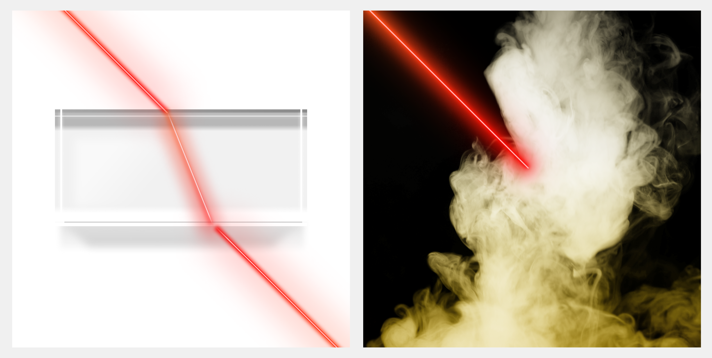

# OMG: Opacity Matters in Material Modeling with Gaussian Splatting
<p align="center"></p>

This repository hosts the code for the paper:

[OMG: Opacity Matters in Material Modeling with Gaussian Splatting (ICLR 2025)](https://arxiv.org/pdf/2502.10988)

by [Silong Yong](https://silongyong.github.io/), [Venkata Nagarjun Pudureddiyur Manivannan](https://www.linkedin.com/in/venkata-nagarjun-pudureddiyur-manivannan-57190b19a/), [Bernhard Kerbl](https://snosixtyboo.github.io/), [Zifu Wan](https://zifuwan.github.io/), [Simon Stepputtis](https://simonstepputtis.com/), [Katia Sycara](http://www.cs.cmu.edu/~sycara/), [Yaqi Xie](https://yaqi-xie.me/)

[arXiv](https://arxiv.org/abs/2502.10988)

## News
- 03/28/2025: Initial release for OMG code!

## Abstract

Decomposing geometry, materials and lighting from a set of images, namely inverse rendering, has been a long-standing problem in computer vision and graphics. Recent advances in neural rendering enable photo-realistic and plausible inverse rendering results. The emergence of 3D Gaussian Splatting has boosted it to the next level by showing real-time rendering potentials. An intuitive finding is that the models used for inverse rendering do not take into account the dependency of opacity w.r.t. material properties, namely cross section, as suggested by optics. Therefore, we develop a novel approach that adds this dependency to the modeling itself. Inspired by radiative transfer, we augment the opacity term by introducing a neural network that takes as input material properties to provide modeling of cross section and a physically correct activation function. The gradients for material properties are therefore not only from color but also from opacity, facilitating a constraint for their optimization. Therefore, the proposed method incorporates more accurate physical properties compared to previous works. We implement our method into 3 different baselines that use Gaussian Splatting for inverse rendering and achieve significant improvements universally in terms of novel view synthesis and material modeling.

## Installation

Please refer to each model for their specific installation.

The code has been tested with Python 3.8.19, PyTorch 1.13.1 and CUDA 12.7 on Ubuntu 24.04


## Running

For each model, please refer to [GaussianShader](./GaussianShader/README.md), [GS-IR](./GS-IR/README.md), [R3DG](./R3DG/README.md) for details on how to run the experiments.

## Misc

Please change to the corresponding directory when running experiments with the models. For example, to experiment with GaussianShader
```shell
cd GaussianShader
```

## TODO

[ ] Release GS-IR implementation
[ ] Release R3DG implementation

## License

- Code: [Apache](./LICENSE)

## Citation
If you find our work helpful for your research. Please consider citing our paper.
```bibtex
@article{yong2025omg,
  title={OMG: Opacity Matters in Material Modeling with Gaussian Splatting},
  author={Yong, Silong and Manivannan, Venkata Nagarjun Pudureddiyur and Kerbl, Bernhard and Wan, Zifu and Stepputtis, Simon and Sycara, Katia and Xie, Yaqi},
  journal={arXiv preprint arXiv:2502.10988},
  year={2025}
}
```